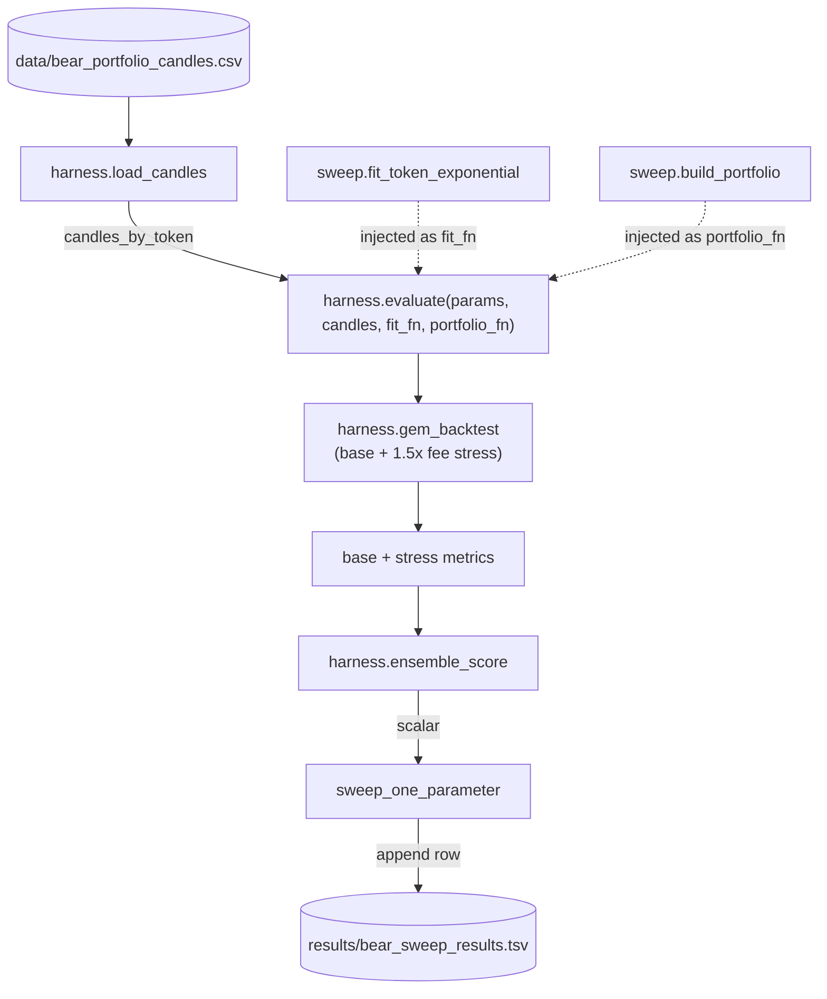
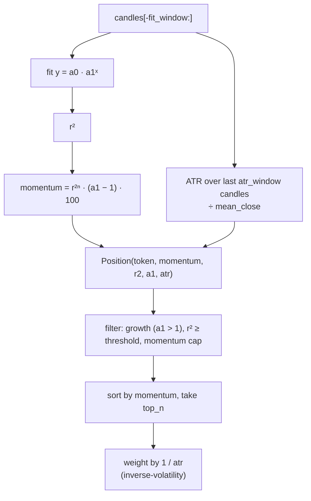

# trader-research

Research artifacts for a bear-specialist trading strategy and a
Karpathy-style autoresearch loop that tunes its parameters
against the 2022 bear-market window.

## Project map

```
trader-research/
├── program.md                              # autoresearch loop spec (operator-facing)
├── harness.py                              # untouchable: data loader, backtest, scoring
├── sweep.py                                # modifiable: GemParams, model body, sweep driver
├── data/
│   └── bear_portfolio_candles.csv          # PAXG, EUR, USDC, TUSD daily candles, May–Dec 2022
├── notebooks/
│   └── gem_bear_models.org                 # exponential vs linear GEM prototype
├── docs/
│   └── autoresearch-reports/               # post-mortems from prior loop runs
├── results/                                # sweep outputs (gitignored)
└── LICENSE
```

The split between `harness.py` and `sweep.py` mirrors the
[autoresearch](https://github.com/karpathy/nanochat) `prepare.py` /
`train.py` setup: the harness is the contract surface the loop cannot
touch (data loader, backtest skeleton, scoring, fee constants); the sweep
is the agent's playground (parameters, model body, driver). See
`program.md` for the operating contract the autoresearch loop runs under.

## Key types and functions

**`harness.py`:**

- `load_candles(path)` -- read the candles CSV, return a `dict[token, DataFrame]`.
- `PortfolioState`, `HeldPosition`, `DaySnapshot` -- portfolio bookkeeping.
- `gem_backtest(params, candles_by_token, fit_fn, portfolio_fn)` -- day-by-day
  causal walk-forward. `fit_fn` and `portfolio_fn` are injected from
  `sweep.py`, so the backtest skeleton stays fixed while the model body
  stays modifiable.
- `ensemble_score(base, stress)` -- the single scalar metric the loop
  optimizes. `score = annualized_return × drawdown_dampener × diversification_bonus`,
  with hard rejection on annualized return below -50% or negative
  stress-test calmar. The name is inherited from the full ensemble's
  scoring contract; only the bear specialist is under test in this repo.
- `evaluate(params, candles_by_token, fit_fn, portfolio_fn)` -- runs base +
  1.5× fee-stress backtests, returns `(score, base_metrics, stress_metrics)`.
  Pins `FEE_RATE` and `INITIAL_CAPITAL` regardless of caller params.
- `FEE_RATE = 0.003`, `FEE_STRESS_MULTIPLIER = 1.5`, `INITIAL_CAPITAL = 10_000.0`.

**`sweep.py` (modifiable interior):**

- `GemParams` -- bear-specialist parameter struct: `top_n`, `r2_threshold`,
  `rebalance_cooldown`, `atr_window`, `fit_window`, `momentum_cap`,
  `r2_exponent`, plus `use_*` ablation flags.
- `Position` -- output of the per-token fit (token, momentum, r2, a1, atr,
  weight).
- `fit_token_exponential(candles, atr_window, r2_exponent)` -- fits
  `y = a0 · a1ˣ` to closes, computes `momentum = r²ⁿ · (a1 - 1) · 100`
  and ATR-normalized volatility.
- `build_portfolio(candidates, params)` -- applies the r²/growth/momentum
  filters, picks `top_n`, weights by inverse volatility (or equal).
- `sweep_one_parameter(name, values, candles, baseline)` -- runs the
  one-at-a-time sweep, scores each candidate via `harness.evaluate`,
  prints per-candidate diagnostics.

The data + control flow:



## Notebooks

### `notebooks/gem_bear_models.org`

Comparing exponential (`y = a0 · a1ˣ`) vs. linear (`y = b0 + b1 · x`)
regression-based GEM models for capital preservation during an
established bear market. The notebook is the prototype the
`fit_token_exponential` / `build_portfolio` primitives in `sweep.py` were
extracted from. Originally published alongside the
[_Winning with the Bear_](https://blog.nodrama.io/gem-bear-market-models/)
blog post.

**Data:** `data/bear_portfolio_candles.csv` -- 788 daily candles across 4
tokens, **May 1 – Dec 31, 2022** (the established 2022 bear market).
Universe is intentionally a stablecoin / safe-haven basket:

| Token       | Type            |
| ----------- | --------------- |
| PAXGUSDT    | Gold-backed     |
| EURUSDT     | Euro-pegged     |
| USDCUSDT    | USD stable      |
| TUSDUSDT    | USD stable      |

Columns: `token, timestamp, open, high, low, close, volume`.

**GEM signal pipeline (per token, per day):**



Sections in the notebook: Description, Setup, Data Loading, Core
Functions, GEM Backtest (Exponential), Metrics Computation, Buy & Hold
Benchmark, plus narrative sections on rolling-window analysis, the R²
"dead cat bounce" filter, and the bear-w30 winning configuration.

## Future directions

The current bear specialist is a long-only stablecoin / safe-haven rotator
-- it preserves capital in a bear market but cannot profit from the
downtrend itself. A natural extension is a more aggressive bear model
built on [dYdX](https://docs.dydx.xyz/) perpetual futures, which would
let the strategy take short positions on the tokens it currently filters
out. The same `r² · (a1 - 1)` momentum signal becomes a short-entry
signal when negated, and the inverse-volatility weighting carries over.

Open questions:
- funding-rate cost vs. the current 30 bps round-trip fee budget
- sizing under leverage
- whether the hard-rejection gate on stress-test calmar still makes sense once shorting is allowed.

A second direction is a **reinforcement-learning search policy** as a
replacement for the autoresearch loop itself. The current loop is a
hand-coded one-parameter-at-a-time scan; an RL agent would learn the
search heuristics from the score signal directly -- for example,
"after finding a good `r2_threshold`, explore `top_n`" emerges from
training rather than being hard-wired in `program.md`.

Sketch:

- **State**: the current `GemParams` tensor plus a summary of past
  evaluations ("where am I in the search space?") -- e.g. a fixed-size
  embedding of the last K (params, score) pairs, or per-axis quantile
  positions of already-tried values.
- **Action**: a parameter edit -- pick an axis, pick a direction or a new
  value (discrete or continuous head per parameter).
- **Reward**: `ensemble_score` from `harness.py`, possibly shaped by the
  delta against the current best.
- **Environment**: a thin wrapper around the same walk-forward causal
  backtest used in the bear-GEM notebook and `harness.evaluate`. The
  scoring contract stays fixed; only the search policy changes.

This is also the natural setting in which to compare phased single-block
sweeping against a true joint-space search and check how much of the
historical "deletion wins" finding survives once interactions are
modeled explicitly.

## License

Apache-2.0. See [`LICENSE`](LICENSE).
